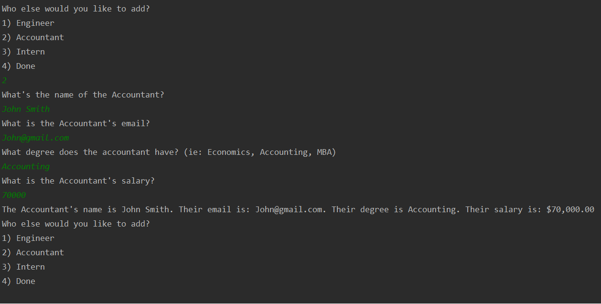

# Team-manager

## Description
As a team manager, I want to assemble my team and view my input at the end. This Java program showcases my self taught Java skills. 
## Table of content
[#Installation](#Installation) 
[#Usage](#Usage) 
[#Credits](#Credits) 
[#License](#License) 
[#Contacts](#Contacts)
## #Installation
No installation required (unless you don't have an IDE). Compile src/TeamCreator.java to start!
## #Usage
This is a Java CLI program that let's you create a team based off your inputs. Once you select finish your final team will be printed out based off your input!

When you first load the program you will see this screen, prompting for a user input:

Once you've completed inputting information for the manager you will be asked to select which team member you would like to add next:

I decided to add an Engineer next for example, you will be prompted to ask for some information on the Engineer:

I have an Accountant I would like to add so I input 2 on the prompt and after a few questions, my Accountant has been added to the team:

Lastly I have an intern I would like to add as well, after selecting intern and answering a few questions about the intern they've also been added to the team:

I added a few more team members and that is my whole team. At the user prompt I tell the program I am done adding members to my team and get a final print out of my team:

## #Credits
N/A
## #License
N/A
## #Contacts
If you have any further questions or comments, please dont hesitate to contact me at: <kinwai.lam730@gmail.com>
  
 